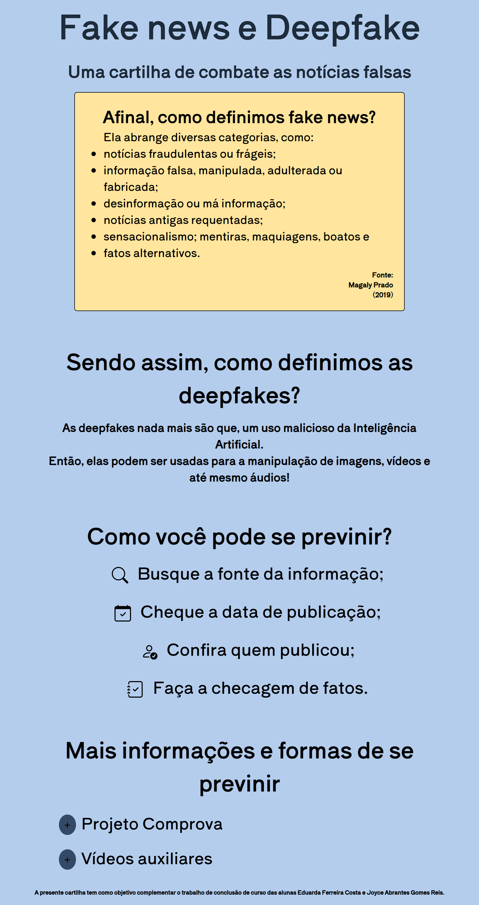

# 📰 Fake News e Deepfake — Cartilha

> Uma cartilha de combate às notícias falsas, complemento do trabalho de conclusão de curso das alunas **Eduarda Ferreira Costa** e **Joyce Abrantes Gomes Reis**.



## 💡 Sobre o projeto

Este site é uma cartilha educativa que explica, em linguagem acessível:

- **O que são fake news** — notícias fraudulentas, informação manipulada, desinformação, sensacionalismo e "fatos alternativos" (com base em Magaly Prado, 2019);
- **O que são deepfakes** — o uso malicioso da Inteligência Artificial para manipular imagens, vídeos e áudios;
- **Como se prevenir** — buscar a fonte da informação, checar a data de publicação, conferir quem publicou e fazer checagem de fatos;
- **Materiais complementares** — o [Projeto Comprova](https://projetocomprova.com.br/about/) e vídeos auxiliares sobre o tema.

## 🛠️ Tecnologias

- HTML5 + CSS3
- [Bootstrap 5](https://getbootstrap.com/)
- jQuery 3.6
- Fonte [Shippori Antique](https://fonts.google.com/specimen/Shippori+Antique) (Google Fonts)

## 🚀 Como visualizar

É um site 100% estático — basta abrir o `index.html` no navegador:

```bash
# opção 1: abrir direto
duplo clique em index.html

# opção 2: servir localmente (ex.: com a extensão Live Server do VS Code)
# ou com Python:
python3 -m http.server 5500
```

## 📁 Estrutura

```
├── index.html      # página única da cartilha
├── style.css       # estilos (tema claro, acessibilidade de contraste)
├── js/script.js    # toggles de conteúdo, loader e galeria de vídeos
├── imgs/           # ícones e imagens da página
└── video.gif       # animação de apoio
```

## ✍️ Autoras

- **Eduarda Ferreira Costa** — [GitHub](https://github.com/dudsfcosta)
- **Joyce Abrantes Gomes Reis** — [GitHub](https://github.com/abrantesjo)
